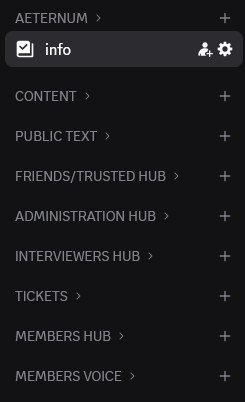
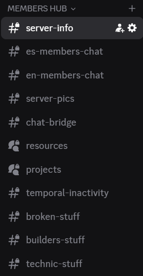
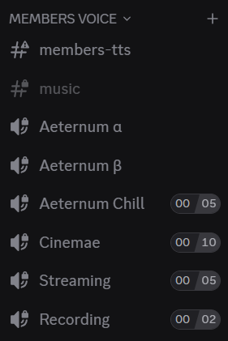
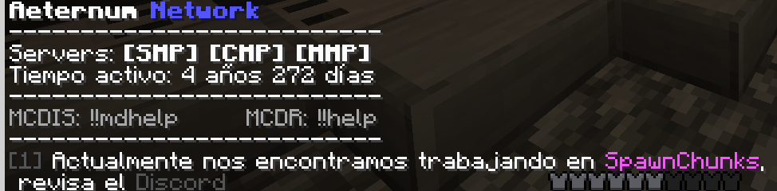
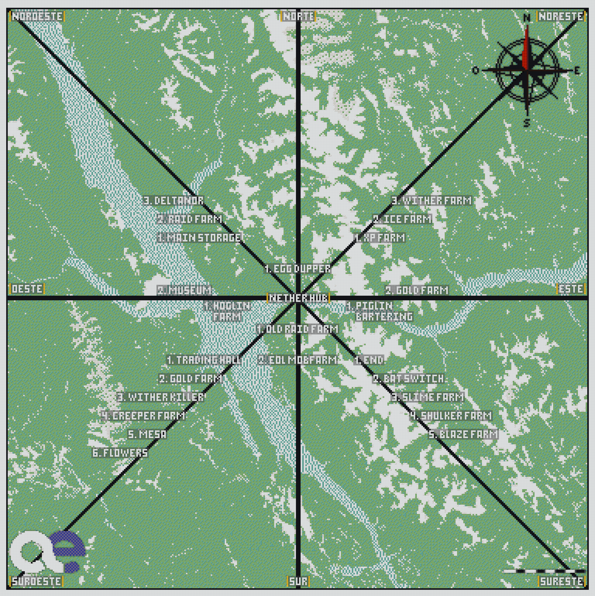

# Aeternum
## Cómo usar este documento

Bienvenido al documento de Aeternum. Su objetivo es ser una **guía de consulta general** para todos los miembros del servidor, especialmente los nuevos. Aquí encontrarás instrucciones, reglas, roles, transporte, comandos y recursos para distintas situaciones. Esta es tu guía principal y así evitas incomodar a los demás.

### Secciones principales para nuevos miembros
Si eres nuevo, lo primero que debes hacer es pedirle a un **administrador** o **entrevistador** que te agregue a la **whitelist**. Asegúrate de dar tu **nickname exacto**, respetando mayúsculas y minúsculas, ya que lo necesitarás para acceder al servidor.

Para comenzar, te recomendamos debes leer sí o sí estas secciones:

- [Reglas de Aeternum](#reglas-de-aeternum) – lo que debes cumplir desde el primer día.  
- [Roles de Aeternum](#roles-de-aeternum) – comprensión de permisos y responsabilidades.  
- [Servidores de Aeternum](#servidores-de-aeternum) – conocer dónde se desarrolla cada proyecto.  
- [Organización del Discord](#organización-del-discord) – cómo interactuar y dónde buscar información.
- [Cómo saber qué hacer](#cómo-saber-qué-hacer) – guía para incorporarte y comenzar a participar.

Revisadas estas secciones, puedes comenzar tu **tour de bienvenida** por Aeternum siguiendo las instrucciones de esta guía:  
- [Tour de Bienvenida](#tour-de-bienvenida)  

Este tour funciona como **primer punto de evaluación** al ingresar al servidor: permite que los nuevos miembros demuestren su capacidad para explorar, comprender la documentación y aprender por su cuenta. Aunque la idea es completar el tour de manera autónoma, puedes realizar **consultas puntuales** si hay alguien conectado en el voice chat o si alguien se ofrece a acompañarte. La finalidad es que avances de manera independiente, consultando solo cuando sea necesario para resolver dudas específicas o aclarar algún procedimiento.

Las demás secciones puedes consultarlas cuando necesites información específica. Se recomienda darles solo una **revisión superficial** en algún momento para no abrumarte con tantos detalles hasta que realmente los necesites y vengas a buscarlos.

### Tabla de contenidos

- [Cómo usar este documento](#cómo-usar-este-documento)
- [Reglas de Aeternum](#reglas-de-aeternum)
- [Roles de Aeternum](#roles-de-aeternum)
- [Servidores de Aeternum](#servidores-de-aeternum)
- [Organización del Discord](#organización-del-discord)
- [Cómo saber qué hacer](#cómo-saber-qué-hacer)
- [Tour de Bienvenida](#tour-de-bienvenida)
- [Organización de Proyectos](#organización-de-proyectos)
- [Medios de Transporte](#medios-de-transporte)
  - [Piston Bolt](#piston-bolt)
  - [Cañón de perlas](#cañón-de-perlas)
- [Comandos del Servidor](#comandos-del-servidor)
  - [Comandos de Discord](#comandos-de-discord)
  - [Comandos in-game (Essential Mod)](#comandos-in-game-essential-mod)
  - [Comandos in-game (MCDReforged)](#comandos-in-game-mcdreforged)
  - [MC-Dis · OP](#comandos-in-game-mc-dis--op)
  - [MC-Dis · Localización](#comandos-in-game-mc-dis--Localización)
  - [MC-Dis · Calculadora](#comandos-in-game-mc-dis--calculadora)
  - [MC-Dis · Execute](#comandos-in-game-mc-dis--execute)
  - [MC-Dis · MOTD](#comandos-in-game-mc-dis--motd)
  - [MC-Dis · Process Manager](#comandos-in-game-mc-dis--process-manager)
  - [MC-Dis · TTS / Discord](#comandos-in-game-mc-dis--tts--discord)
  - [MC-Dis · Regional Backups](#comandos-in-game-mc-dis--regional-backups)
  - [MC-Dis · Region Updater](#comandos-in-game-mc-dis--region-updater)
- [Preguntas Frecuentas](#preguntas-frecuentes)

## Reglas de Aeternum

- No filtrar mensajes fuera del servidor:
- No se tolerará ningún tipo de toxicidad:
- Quien grifee el servidor será baneado permanente:
- Si se llegara a romper una granja, AVISA:
- Está prohibido generar mundo sin razón:
- No está permitida la duplicación de ítems:
  Excepciones: bloques con gravedad, elitrós y esponjas.

## Roles de Aeternum

- `Miembro a prueba`: rol asignado a los miembros recién incorporados. El período de prueba comienza al recibir el rol y finaliza cuando los entrevistadores deciden otorgar el rol de miembro permanente. Durante este tiempo se evalúa la interacción con otros miembros y el desempeño en el servidor. Ausentarse por períodos prolongados (2–3 semanas o más) es contraproducente, ya que el objetivo es conocer a la persona.

- `Miembro`: una vez obtenido este rol, es poco probable que sea revocado, salvo en casos de incumplimiento grave de las reglas del servidor. Está destinado a personas con las que existe una buena relación y que ya han aportado activamente al servidor.

- `Entrevistador`: rol otorgado a miembros activos que apoyan el progreso de los proyectos. Permite evaluar postulantes, participar en la coordinación inicial de nuevos proyectos y organizar actividades como tours. 

- `Staff / Admin`: rol reservado para personas de confianza de los administradores actuales. Está orientado a quienes participan activamente en la organización y gestión del servidor. Desde aquí se administran los servidores, el dedicado, las cuentas oficiales, Discord, Patreon, entre otros. 

## Servidores de Aeternum
Aeternum cuenta con **cinco servidores**: cuatro oficiales y uno auxiliar (dummy).

- **SMP (Survival Multiplayer)**: servidor principal, donde se desarrollan los proyectos definitivos.
- **CMP (Creative Multiplayer)**: servidor de diseño; aquí se planifican y construyen las ideas antes de probarlas.
- **MMP (Mirror Multiplayer)**: servidor de pruebas, utilizado para verificar el funcionamiento de mecanismos antes de implementarlos en el SMP.
- **PMP (Plugins Multiplayer)**: servidor orientado a builders, con distintos plugins enfocados en construcción.
- **Dummy**: servidor auxiliar para uso variado. Se emplea para montar servidores temporales con temáticas específicas (por ejemplo, Cobblemon, Create Mod, etc.).

Los servidores **SMP, CMP y MMP** están interconectados y son accesibles desde una **única IP**. Es posible moverse entre ellos usando el comando `/server <SERVIDOR>`.  
Los otros dos servidores cuentan con **IPs independientes**.

## Organización del Discord

Organizamos el servidor a través de Discord, en este tenemos varias categorías:

  

    
  

  

    
  

  

    
  

📌 Sección 1: Información y Contenido (Opcional)

- **Aeternum**: categoría general para información de cara al público, avances y anuncios.
  - **public archive**: los miembros publican sus propios trabajos o aportes.
  - **server-content**: administrado por admins, contiene material oficial y promocional.
  - **updates**: miembros publican actualizaciones y actividad del servidor.

- **Content**: publicación de contenido por parte de los miembros.
  - **members**: los miembros comparten su propio contenido.
  - **twitch**: aviso de streams en Twitch por los miembros.

- **Public Text**: interacción con el público general.

- **Friends/Trusted Hub**: interacción con amigos o miembros de confianza.

- **Administration Hub**: coordinación de los administradores sobre el servidor.

- **Interviewers Hub**: revisión de solicitudes de acceso y formularios.

- **Tickets**: solicitudes de acceso al servidor.

### 📌 Sección 2: Interacción entre miembros

- **Server Info**: información del servidor (IP, reglas, anuncios, whitelist, proyectos y aportes).  
- **Es Members Chat**: chat general en español.  
- **En Members Chat**: chat general en inglés.  
- **Server Pics**: mensajes centrados en imágenes.  
- **Chat Bridge**: mensajes hacia y desde los servidores de Minecraft.  
- **Resources**: recopilación de guías, litemáticas, mods, shaders y texture packs.  
- **Projects**: foro de discusión de proyectos de miembros.  
- **Temporal Inactivity**: avisos de ausencia prolongada (miembros 1 mes mínimo, miembros a prueba 1 semana mínimo).  
- **Broken Stuff**: reporte de mecanismos rotos con coordenadas y explicación.  
- **Builders Stuff**: contenido relacionado a construcción en Minecraft.  
- **Technic Stuff**: contenido relacionado al aspecto técnico en Minecraft.

### 📌 Sección 3: Voz de miembros

- **Members TTS**: mensajes enviados al bot TTS.  
- **Music**: control de bots de música.  
- **Canales de Voz**: conversación entre miembros.  
  - **Cinema**: ver películas.  
  - **Streaming**: transmisión en Twitch.  
  - **Recording**: grabación de videos.

## Organización de Proyectos

En Aeternum, los proyectos suelen desarrollarse en varias fases bien definidas:

- **Discusión**:  
  La mayoría de las ideas surgen en voice chat, donde se discuten de forma informal. También se pueden proponer proyectos en el canal de chat de miembros.  
  Si la idea genera interés, se crea un foro de discusión del proyecto en Discord, dentro de la sección de miembros, canal **projects**. Ahí comienza la planificación formal y se van publicando avances, diseños y actualizaciones.

- **Planificación según el tipo de proyecto**:  
  - **Redstone y granjas**: deben cumplir ciertos estándares, principalmente por temas de lag. Se evalúa la mecánica a utilizar y se intenta que el diseño no quede obsoleto en el corto plazo.  
  - **Decoración y construcción**: se considera si la estructura debe ser *spawn proof*, si es viable en survival y si se integra correctamente con el terreno natural.

- **Pruebas en el servidor Mirror**:  
  Una vez finalizado el diseño en creativo, se prueba en el servidor mirror para verificar que funcione correctamente y que sea apto para el servidor de supervivencia.

- **Ejecución del proyecto**:  
  La implementación en survival depende de que no haya demasiados proyectos inconclusos y de la prioridad asignada frente a otros proyectos activos.

- **Instrucciones de ejecución**:  
  Hasta este punto, todo el desarrollo ocurre en el foro del proyecto dentro de **projects**.  
  Cuando el proyecto entra en fase de ejecución, los administradores publicarán en el canal **members-info** las instrucciones claras sobre cómo proceder y los pasos concretos a seguir.

- **Tareas en el join-MOTD**:  
  Al entrar al servidor, el mensaje de bienvenida suele mostrar las tareas activas. Procuramos mantenerlo actualizado para que siempre sea claro en qué se está trabajando.  
  **Léanlo.**

## ¿Cómo saber qué hacer?

En Aeternum los miembros tienen bastante libertad sobre qué actividades realizar en el servidor. En ocasiones, por motivos específicos, se establece que todos trabajen en un único proyecto; sin embargo, en general, si ya sabes lo que haces y los administradores no tienen inconveniente, puedes trabajar en lo que desees.  

Para los miembros nuevos, normalmente no es evidente qué hacer desde el inicio, ya que se requiere un periodo de adaptación al servidor. Mientras decides qué proyecto te interesa, puedes colaborar en los proyectos principales para familiarizarte con la dinámica del servidor.  

### <u>Consultar tareas activas</u>

Las tareas de los proyectos se publican en la sección **members-info**. En el banner encontrarás la sección **tareas de proyectos**, donde se muestran los hilos con las tareas activas. Si no hay hilos activos, significa que no hay tareas pendientes. En estos hilos se indican instrucciones detalladas sobre qué hacer y cómo hacerlo.  

Otra forma de conocer las tareas es al entrar al servidor: el **mensaje de bienvenida** muestra las tareas activas. Procuramos mantenerlo actualizado para que siempre sea claro en qué se está trabajando. **Léanlo.**

  

## Tour de Bienvenida

Aeternum es un servidor de Minecraft con un modo de juego avanzado, por lo que puede tener una curva de aprendizaje elevada. Este tour sirve como introducción autodidacta: se aprende explorando y revisando la documentación, ya que nadie está destinado a enseñarle todo a cada jugador. Venimos a jugar, y para participar en este modo de juego muchas veces hay que aprender por uno mismo. Explicar lo mismo a cada jugador repetidamente es agotador, especialmente cuando entran muchos nuevos miembros; el servidor funciona mejor cuando cada jugador pone de su parte y aprende por sí mismo para no incomodar a los demás. Esto no significa que no haya ayuda disponible, sino que es fundamental entender que la iniciativa personal es clave para integrarse y participar. Como primera prueba en el servidor, se te pedirá que realices un tour por tu cuenta. El objetivo es que conozcas las funciones básicas del servidor antes de integrarte al proyecto principal. Las tareas son las siguientes:

1. **Instalar Minecraft Fabric 1.21.4**  
   - Crea una instancia con esta versión para poder usar los mods del servidor.

2. **Instalar el Pack de mods de Aeternum .**  
   - Ve al canal **Resources** dentro de la sección de miembros y busca el foro **Mods**.  
   - Ahí encontrarás el **Aeternum Pack**, un conjunto básico de mods que incluye: Litematica, Tweakeroo, Mini HUD, mods de optimización, SyncMatica, entre otros.  
   - Aunque es posible entrar al servidor en modo vanilla, se recomienda instalar el pack, ya que lo necesitarás más adelante para colaborar en el servidor.

3. **Conectarse al servidor.**  
   - Obtén la IP del servidor en el canal **members-info**, cópiala y agrégala a tus servidores en Minecraft.

4. **Solicitar acceso a la whitelist.**  
   - Solo los entrevistadores pueden agregarte a la whitelist.  
   - Debes proporcionarles tu nickname exacto, respetando mayúsculas y minúsculas, en caso de no haberlo hecho antes.

5. **Recoger recursos iniciales en el spawn.**  
- Al iniciar, spawnearás en el **spawn de Aeternum**. Allí encontrarás cofres con shulkers que contienen cohetes, comida, elytras, perlas de Ender y otros recursos.  
- Todos estos ítems son de **uso público**. Toma solo lo necesario para comenzar:  
  - Shulkers de elytras: 1 por jugador.  
  - Cohetes: aproximadamente 3 stacks.  
  - Comida: al menos 64 unidades.  
  - Perlas de Ender: unas 16 unidades.  
  - Otros ítems: cantidad razonable según tu criterio.  
- No llenes todo tu inventario; respeta el uso público de los recursos.  
- Si por alguna razón no ves el logo de Aeternum en el piso hecho con bloques de cristal, suicídate para regresar al spawn.  
- Si no hubieran recursos en la zona inicial, no te preocupes; avanza que en el Main Storage sí los hay.

> **Probar comandos básicos:**  
> Una vez tengas tus recursos, es recomendable familiarizarte con algunos comandos del servidor (Essential Mod) que te facilitarán moverte y recolectar ítems:  
> - `/cs`: te coloca en **modo espectador** y te permite moverte libremente. Al volver a supervivencia, regresarás al lugar donde estabas.  
> - `/subscribe essential_careful_break`: activa que los bloques que piques se envíen **directamente a tu inventario** solo cuando estés agachado (shift).  
> - `/subscribe always_careful`: si ya estás suscrito a *careful break*, este comando elimina la necesidad de agacharte; los bloques irán a tu inventario estés agachado o no.  
> - `!!here`: muestra tu **posición actual en coordenadas**, incluyendo equivalencias entre Overworld y Nether. También te aplica el efecto glowing durante unos segundos, así es más fácil encontrarte.  

6. **Explorar el Nether Hub.**  
   - Desde el spawn, camina hasta el **portal más cercano**, ubicado en el centro de la plataforma de spawn.  
   - Aparecerás en el **segundo nivel del Nether Hub**, donde verás:  
     - El portal principal (0,0).  
     - Varias entradas hacia el primer nivel en el piso.  
   - Baja por cualquiera de estas entradas para acceder a la **zona inferior**, donde se encuentran todos los pasillos del Nether Hub. Observa las **líneas del Piston Bolt**.  
   - Para llegar a la **estación del Nether Hub**, rodea el centro del primer piso y busca la entrada; la estación está dentro.  
   - Una vez allí, sigue la sección **Medios de Transporte → Piston Bolt** de este documento. Lee **solo** hasta la explicación sobre el uso básico del Piston Bolt, así podrás llegar al Main Storage. Luego regresa a esta sección para continuar.

7. **Explorar el Main Storage.**  
   - Al salir de la estación, encontrarás un **portal** que te lleva al Overworld.  
   - Una vez dentro:  
     - **Izquierda:** periféricos como Crafter Automático, Horno Automático, mesas de pociones y cofres para guardar materiales de nuevos proyectos. El horno es fácil de usar, tiene carteles con todo lo necesario. Los demás no los toques, con el tiempo puedes aprender a usarlos.
     - **Derecha:**  
       - Primera sala: **filtro de ítems no stackeables** y un **refill** similar al del spawn. Aquí encontrarás:  
         - Cohetes y elytras.  
         - Armaduras: puedes tomar solo **una** de cada parte para usar.  
         - Picos: puedes tomar una shulker.  
         - Totems: máximo **3 unidades**.  
         - Comida: puedes tomar una shulker.  
       - Más adelante encontrarás la **fuente central**, rodeada por 3 pasillos. Aquí puedes **tirar todos los ítems que quieras**, incluyendo shulkers. El Main Storage sirve principalmente para **organizar y basear tu inventario**.

   - **Pasillos alrededor de la fuente:**  
     1. **Almacenamiento masivo:**  
        - Cofres y shulkers blancas en patrones repetitivos en el piso.  
        - Contiene items de granjas, drops de mobs, madera, bloques minados o de la quarry, y redstone.
        - Puedes sacar shulkers de los cofres o items singulares de las shulkers en el piso.
     2. **Zona de colores y objetos teñibles:**  
        - Todos los colores de tintes y los objetos que se pueden teñir (concreto, terracota, cristales, etc.).  
        - Continuando por este pasillo, verás una bifurcación (ignórala por ahora).  
        - Más adelante: mesas de trabajo, rieles, comida, items que solo se colocan en marcos, etc.  
     3. **Almacén híbrido (en la bifurcación):**  
        - Para ítems que se generan en cantidades intermedias (muchas shulkers, pero no suficiente para un almacenamiento masivo).  
        - Cofres y shulkers en el piso y techo.  
        - Puedes observar cuál shulker se está llenando y a qué almacen se dirigen los ítems cuando se llena.
     4. **Zona de bloques de construcción:**  
        - A penas entras verás bloques relacionados con madera, este es el pasillo de bloques generales del juego.

8. **Uso del cañón de TNT y checkpoints en el Nether.**  
- Después de explorar el **almacen general**, regresa hacia el **Nether**.  
- Frente a la estación del **Piston Bolt**, encontrarás un **panel** y lo que llamamos un **cañón de TNT**.  
  - Estos cañones funcionan acelerando una **enderpearl** de manera precisa para transportarte rápidamente.  

- **Checkpoint en el Nether:**  
  - Antes de usar el cañón, avanza hacia el mueble al costado del cañón.  
  - En el piso verás un espacio designado para hacer **checkpoint** en el Nether.  
  - Al lado hay un **portal al End** en el piso. Cruza el portal y, en el End, verás otro portal detrás del lugar donde spawneas. Atraviesa ese portal; esto sirve para mostrar por qué hacemos checkpoint en el Nether. Tener estos bloques de portal facilita mucho el desplazamiento por el mapa.

- **Aprender a usar el cañón:**  
  - Consulta la sección **Medios de Transporte → Cañón de perlas** en este documento para entender su funcionamiento.  
  - La idea es usar el cañón para llegar a la **granja de XP** y, con el tiempo, se volverá tu herramienta principal para moverte rápidamente por todo el servidor. Aprender a usarlo te será muy útil.

9. **Explorar la granja de XP.**  
- Al llegar a la **granja de XP**, busca el **portal del Nether**. Normalmente se encuentran a la altura de la bedrock del techo; si usas el cañón de enderpearls, aparecerás en plataformas flotantes sobre el techo.  
- Cruza el portal y sigue el camino. Nota que este lugar puede generar **lag** si tu PC no es muy potente debido a la acumulación de XP y portales.  

- En la zona central, verás en el piso una **placa de presión** o una **palanca**:  
  - **Placa de presión:** párate encima y la XP empezará a generarse en unos segundos (aprox. 15 s). Luego será continua.  
  - **Palanca:** actívala o desactívala; la XP empezará a fluir de manera similar.  
- Esta granja también cuenta con **yunques** disponibles.

- Antes de entrar en la zona donde cae la XP, debiste ver el **portal al End**. No es necesario preocuparse por la granja, no se rompe. Para salir:  
  - Puedes volver volando al portal del Nether o atravesar al End.  
  - En esta ocasión, utiliza el End; una vez allí, retrocede y atraviesa el portal para regresar a tu **checkpoint**.  

10. **Visitar el Trading Hall**  
- Para llegar al **Trading Hall**, cruza nuevamente al **End**. Lo hicimos antes para que veas lo práctico que es usar el End como transporte rápido.  
- Una vez de regreso en el End, sobre la **plataforma de spawn**, encontrarás una **plataforma de cuarzo** con una **End Gateway**.  
- Cruza la gateway usando la plataforma blanca; del otro lado está el **Trading Hall**.  

- Dentro del Trading Hall:  
  - La zona puede verse desordenada, pero en los cofres encontrarás **esmeraldas en abundancia**.  
  - Úsalas para comerciar con los aldeanos, que venden herramientas, armaduras y encantamientos. Funciona como un trading normal.  
  - No te preocupues por la **redstone** del Trading Hall, luego podrás aprender a usarla.

11. **Finalización del tour**  
- Con esto concluye tu **tour inicial** por Aeternum.  

- Al finalizar, informa a los **admins** o a la persona que te haya recibido para recibir una **introducción más cálida**:  
  - Te explicarán qué se está haciendo actualmente en el servidor y te darán un **recorrido más cercano**, donde podrás interactuar con nosotros y familiarizarte plenamente con la comunidad y el proyecto.

## Medios de Transporte

En Aeternum, todo el transporte de larga distancia se realiza a través del **Nether**.  
El sistema principal es el **piston bolt**, elegido porque es estable, rápido y poco propenso a romperse a largo plazo.  
Actualmente, y gracias a la versión del servidor, también se utiliza con frecuencia el **cañón de perlas**, aunque el piston bolt sigue siendo la infraestructura base.

A continuación se explica el funcionamiento de cada sistema:

### Piston Bolt

  

#### <u>Estructura general del sistema</u>

- En el **techo del Nether** existe una estación de piston bolt para **cada proyecto importante** del servidor.
- El **Nether Hub** es la estación principal y la más accesible:
  - Se llega cruzando el portal de spawn.
  - Luego se desciende hasta el centro del hub.
  - Allí se encuentra la estación principal del sistema.

Cada estación cuenta con:
- Un **mapa** (flecha dentro de un marco).
- **Carteles** con información de dirección y estación.
- Un **lectern** (atril) con un libro numerado para seleccionar el destino.

#### <u>Orientación y carteles</u>

- En el **Nether Hub**, los carteles están orientados según las **líneas cardinales reales** (Norte, Sur, Este, Oeste).
- En las estaciones que **no** son el Nether Hub:
  - El **cartel superior** indica siempre:
    - La rama (línea cardinal),
    - El número de estación,
    - El nombre de la estación.
  - La orientación física puede variar, por lo que **no debes guiarte por la dirección en la que miras**, sino por el **texto del cartel**.

#### <u>Uso básico del piston bolt (cambio de rama)</u>

1. Observa el **mapa** y decide a qué estación deseas ir.  
   Ejemplo: *Main Storage*, ubicado en la rama **Noroeste**, estación **1**.
2. Apunta la **flecha del mapa** al **cartel que tenga el nombre/dirección correcta** (no a la dirección física).
3. En el **libro del lectern**, selecciona la **página con el número de estación** correspondiente.
4. Súbete a la **minecart**.

Este procedimiento funciona para **todas las estaciones**, salvo una excepción que se explica a continuación.

#### <u>Uso avanzado del piston bolt (misma rama)</u>

Moverse dentro de una misma rama (misma línea cardinal) requiere un paso adicional.  
Esto **solo aplica** cuando no cambias de rama.  
Ejemplos de cambio de rama:  
- Norte → Sur  
- Noroeste → Sudeste  

En estaciones que no son el Nether Hub verás en el piso:
- Dos lámparas:
  - Una con **alfombra verde**.
  - Una con **alfombra roja**.
- Un **note block** entre ambas lámparas.

#### <u>Significado de las lámparas</u>

- **Verde**: moverte hacia estaciones con **número mayor**.
- **Rojo**: moverte hacia estaciones con **número menor**.

El note block permite alternar entre verde y rojo (pícalo una vez para cambiar).

#### Ejemplo 1: avanzar estaciones
- Estás en la estación **1**.
- Quieres ir a la estación **5** de la misma rama.
- Diferencia: **4 estaciones hacia adelante**.
- Pasos:
  1. Apunta la flecha **hacia arriba** (el cartel superior indica la rama actual).
  2. Ajusta la lámpara a **verde**.
  3. En el libro, selecciona **4**.
  4. Súbete a la minecart.

#### Ejemplo 2: retroceder estaciones
- Estás en la estación **6**.
- Quieres volver a la estación **2**.
- Diferencia: **4 estaciones hacia atrás**.
- Pasos:
  1. Apunta la flecha **hacia arriba**.
  2. Ajusta la lámpara a **rojo**.
  3. En el libro, selecciona **4**.
  4. Súbete a la minecart.

#### Ejemplo 3: regreso al Nether Hub
- El **Nether Hub** siempre se considera la **estación 0** de cualquier rama.
- Para volver al hub desde una estación:
  - Ajusta el color según corresponda.
  - Introduce el número de estaciones necesarias hasta llegar a **0**.

### Cañón de Perlas

El cañón de perlas se encuentra **frente a la estación del piston bolt del Main Storage** y cuenta con un **panel de selección tipo matriz** controlado por **note blocks en el piso**.

**<u>Modo individual</u>**  
1. Selecciona el destino con los note blocks.  
2. Colócate en la zona de lanzamiento, pegado a la **trapdoor** y al **glass pane**.  
3. Un **dropper** soltará automáticamente una ender pearl.  
4. Mira **recto hacia arriba**, lanza la perla y **no te muevas**.  
5. Espera la teletransportación.

**<u>Modo múltiple</u>**  
1. Selecciona el destino con los note blocks.  
2. Baja la **palanca a la izquierda** para activar modo múltiple.  
3. Todos los jugadores se colocan en la zona de lanzamiento.  
4. Cada jugador espera recibir su perla y la lanza mirando recto hacia arriba.  
5. Una vez lanzadas todas las perlas, baja la palanca.  
6. Nadie debe moverse mientras espera la teletransportación.

#### Advertencias importantes

- **No uses shift** al lanzar la perla.  
- No te muevas después de lanzarla.  
- No cambies el destino mientras haya jugadores en la zona de lanzamiento.

## Información de cada Proyecto

## Comandos del Servidor
Dependiendo del contexto en el que te encuentres, puedes utilizar distintos comandos relacionados con el servidor.

#### <u>Comandos de Discord</u>:
- `!!online`: en el canal **chat-bridge** (sección miembros), muestra qué jugadores están conectados al servidor.
- `!!bots`: en el canal **chat-bridge** (sección miembros), muestra qué bots están conectados al servidor.
- `!!digs`: puede usarse en cualquier canal del Discord de Aeternum; muestra la tabla de puntuaciones con la cantidad de bloques picados por cada jugador.

#### <u>Comandos in-game (Essential Mod)</u>:
- `/cs`: te coloca en modo espectador y te permite moverte libremente. Al volver al modo supervivencia, regresarás al lugar donde estabas antes de entrar en espectador.
- `/subscribe essential_careful_break`: permite que los bloques que piques se envíen directamente a tu inventario **solo cuando estás agachado** (shift).
- `/subscribe always_careful`: si ya estás suscrito a *careful break*, este comando elimina la necesidad de agacharte; los bloques irán a tu inventario estés o no agachado.

#### <u>Comandos in-game (MCDReforged)</u>:
- `!!help`: muestra la lista de comandos disponibles proporcionados por MCDReforged.
- `!!qb list`: muestra la lista de backups del servidor disponibles en ese momento.
- `!!qb make <comentario>`: crea un backup del servidor con el comentario que indiques.

#### <u>Comandos in-game (MC-Dis)</u>:
- `!!mdhelp`: muestra el comando principal de ayuda de MC-Dis y redirige a la lista de comandos predefinidos.

#### <u>Comandos in-game (MC-Dis · Calculadora)</u>:
Esta extensión permite hacer cálculos matemáticos desde minecraft.

- `!!md calc`: muestra los comandos disponibles para usar la calculadora.
- `!!md calc ==<expresión>`: evalúa la expresión matemática indicada y devuelve el resultado.
- `!!md calc =?<expresión>`: evalúa la expresión matemática y devuelve el resultado expresado en **SB**, **Stacks** e **Items**.

Las expresiones deben escribirse en **sintaxis Python** y están limitadas por seguridad. Se permite el uso del módulo `math` y de `numpy` como `np`.

<blockquote>
<strong>Operadores permitidos</strong> 
- <code>+</code>, <code>-</code>, <code>*</code>, <code>/</code>, <code>//</code>, <code>%</code>, <code>**</code> 
- Paréntesis <code>(</code> <code>)</code> para agrupar operaciones  

<strong>Funciones disponibles</strong> 
- <code>abs(x)</code> 
- <code>round(x)</code> 
- Funciones y constantes del módulo <code>math</code> 
- Funciones y constantes básicas de <code>numpy</code>, accesibles como <code>np</code>
</blockquote>

#### <u>Comandos in-game (MC-Dis · Execute)</u>:
Esta extensión permite al usuario establecer una serie de comandos predefinidos lo cual permite que se ejecuten bloques de comandos a petición.

- `!!commands`: lista todos los comandos  predefinidos disponibles en el servidor.
- `!!<comando>`: muestra la descripción del comando seleccionado y las acciones disponibles para ese comando.
- `!!<comando> <acción>`: ejecuta la acción indicada del comando.

#### <u>Comandos in-game (MC-Dis · MOTD)</u>:
Esta extensión tiene como función principal mostrar un mensaje de bienvenido personalizado cada vez que entra un jugador al servidor.

- `!!join-motd`: vuelve a mostrar el mensaje de bienvenida del servidor.
- `!!motd help`: muestra los comandos disponibles relacionados con el MOTD.

<blockquote>
<strong>Comandos de administradores:</strong>
<ul>
  <li><code>!!add-motd &lt;mensaje&gt;</code>: añade un nuevo mensaje al MOTD que verán los jugadores al entrar.</li>
  <li><code>!!del-motd &lt;índice&gt;</code>: elimina un mensaje del MOTD según su número en la lista.</li>
</ul>
</blockquote>

#### <u>Comandos in-game (MC-Dis · Process Manager)</u>:
Esta extensión permite ver jugadores conectados, consultar el estado del servidor y administrar los procesos (servidores) desde el juego.

- `!!online`: muestra los jugadores conectados en cada servidor.
- `!!pm help`: muestra la lista de comandos disponibles del gestor de procesos.
- `!!status`: muestra el estado del servidor (uso de CPU, RAM, disco y servidores activos).
- `!!start <proceso>`: inicia un servidor o proceso apagado.

<blockquote>
<strong>Comandos de administradores:</strong>
<ul>
  <li><code>!!stop [proceso]</code>: detiene el proceso indicado. Si no se especifica ninguno, se detiene el servidor actual.</li>
  <li><code>!!restart [proceso]</code>: reinicia el proceso indicado. Si no se especifica ninguno, se reinicia el servidor actual.</li>
  <li><code>!!mdreload [proceso]</code>: recarga los mdplugins del proceso indicado o del servidor actual.</li>
  <li><code>!!adreload</code>: recarga los mdaddons del sistema.</li>
</ul>
</blockquote>

#### <u>Comandos in-game (MC-Dis · TTS / Discord)</u>: 
Esta extensión permite enviar tus mensajes del chat del juego directamente a un canal de Discord mediante un webhook.

- `!!tts`: activa o desactiva el envío de tus mensajes al canal de Discord configurado.

<blockquote>
<strong>Cómo funciona:</strong>
<ul>
  <li>Al ejecutar <code>!!tts</code> quedas <strong>suscrito</strong>: todos los mensajes que escribas en el chat del juego se enviarán automáticamente a Discord.</li>
  <li>Si vuelves a ejecutar <code>!!tts</code>, te <strong>desuscribes</strong> y tus mensajes dejarán de enviarse.</li>
  <li>Solo se envían mensajes normales del chat; los comandos que empiezan con <code>!!</code> no se reenvían.</li>
  <li>Los mensajes aparecen en Discord con tu nombre de jugador y tu cabeza de Minecraft como avatar.</li>
</ul>
</blockquote>

<blockquote>
<strong>Notas importantes:</strong>
<ul>
  <li>Si sales del servidor, la suscripción se desactiva automáticamente.</li>
  <li>El canal de Discord es fijo y está definido por el servidor.</li>
  <li>Este sistema no es texto-a-voz: simplemente reenvía texto del juego a Discord.</li>
</ul>
</blockquote>

#### <u>Comandos in-game (MC-Dis · OP)</u>:
Este comando permite otorgar permisos de administrador directamente desde el juego. Este comando solo está habilitado en los servidores **CMP**, **MMP** y **PMP**.

- `!!op`: te otorga permisos de operador (admin) en el servidor actual.

### <u>Comandos in-game (MC-Dis · Localización)</u>:
Esta extensión permite consultar posiciones de jugadores y aplicar **glowing permanente** a jugadores, útil para guías, tours o administración visual en el servidor.

- `!!loc help`: muestra todos los comandos de localización disponibles.
- `!!here`: muestra tu posición actual en coordenadas, incluyendo equivalencias entre Overworld y Nether.
- `!!where <player>`: muestra la posición de otro jugador conectado (también funciona con bots). No distingue mayúsculas/minúsculas.
- `!!glow <player | default: tú>`: activa o desactiva **glowing permanente** sobre un jugador.  
  - Si no se indica jugador, se aplica sobre el propio jugador.  
  - Solo administradores pueden aplicar glow a otros jugadores; usuarios normales solo pueden quitarse a sí mismos.

<blockquote>
<strong>Notas importantes:</strong>
<ul>
  <li>El comando `glow` es un toggle: si ya tiene glowing permanente, se lo quita; si no lo tenía, se lo activa.</li>
  <li>Los jugadores conectados se buscan tanto en la lista de jugadores online como en bots.</li>
  <li>Los mensajes se muestran con `tellraw` y son interactivos, mostrando coordenadas y estado del glow.</li>
</ul>
</blockquote>

#### <u>Comandos in-game (MC-Dis · Regional Backups)</u>:
Esta extensión permite crear, actualizar y restaurar **backups parciales del mundo**, basados en **regiones** (chunks), en lugar de respaldar el mundo completo.  

Está pensada para proteger zonas específicas (construcciones, granjas, áreas de eventos, etc.).

- `!!rb help`: muestra todos los comandos disponibles del sistema de regional backups.  
- `!!rb add`: añade a tu lista la región donde te encuentras actualmente.  
- `!!rb del <índice>`: elimina una región de tu lista según su número.  
- `!!rb list`: muestra la lista de regiones que tienes seleccionadas.  
- `!!rb clear`: limpia por completo tu lista de regiones.  
- `!!rb mk-bkp <nombre>`: crea un backup regional con las regiones añadidas.  
- `!!rb update <nombre>`: actualiza un backup existente reimportando esas regiones (**solo el creador del backup o los administradores pueden hacerlo**).  
- `!!rb bkps`: muestra la lista de backups regionales disponibles.  

<blockquote>
<strong>Comandos de administradores (Solo en el SMP):</strong>
<ul>
  <li><code>!!rb load-bkp &lt;nombre&gt;</code>: carga un backup regional y restaura sus regiones en el mundo.</li>
  <li><code>!!rb confirm</code>: confirma la carga del backup (el servidor se reiniciará).</li>
  <li><code>!!rb del-bkp &lt;nombre&gt;</code>: elimina un backup regional existente.</li>
</ul>
</blockquote>

<blockquote>
<strong>Cómo funciona el sistema:</strong>
<ul>
  <li>Las regiones se agregan usando <code>!!rb add</code> desde tu posición actual.</li>
  <li>Se respaldan regiones del <em>Overworld</em>, <em>Nether</em> y <em>End</em> automáticamente.</li>
  <li>Los backups se guardan como archivos <code>.zip</code> con un registro interno de regiones y del creador.</li>
  <li>Al cargar un backup, el servidor se detiene y reinicia de forma controlada.</li>
  <li>Solo una persona puede crear o cargar un backup a la vez.</li>
</ul>
</blockquote>

<blockquote>
<strong>Notas importantes:</strong>
<ul>
  <li>En servidores SMP, algunos comandos están restringidos a administradores o al creador del backup.</li>
  <li>Este sistema no reemplaza los backups completos del servidor.</li>
  <li>Está diseñado para restauraciones precisas, no para rollback global.</li>
</ul>
</blockquote>

#### <u>Comandos in-game (MC-Dis · Region Updater)</u>:
Esta extensión permite **copiar o eliminar regiones específicas** desde el servidor **SMP** hacia otros servidores, sin necesidad de restaurar mundos completos.

Su objetivo principal es **sincronizar zonas concretas** (construcciones, mapas, eventos) entre servidores.

- `!!ru help`: muestra todos los comandos disponibles del region updater.
- `!!ru add`: añade a tu lista la región donde te encuentras para **copiarla desde SMP**.
- `!!rm add`: añade a tu lista la región donde te encuentras para **eliminarla en el servidor actual**.
- `!!ru list`: muestra la lista de regiones marcadas para copiar o eliminar.
- `!!ru clear`: limpia completamente tu lista de regiones.
- `!!ru update`: ejecuta la actualización de regiones (el servidor se reiniciará).

<blockquote>
<strong>Cómo funciona el sistema:</strong>
<ul>
  <li>Las regiones se seleccionan usando <code>!!ru add</code> o <code>!!rm add</code> desde tu posición actual.</li>
  <li>Las regiones marcadas con <code>ru</code> se copian desde el servidor SMP.</li>
  <li>Las regiones marcadas con <code>rm</code> se eliminan del servidor actual.</li>
  <li>El proceso es automático y se realiza por archivos de región (<code>.mca</code>).</li>
  <li>Durante la actualización, el servidor se apaga y reinicia de forma controlada.</li>
</ul>
</blockquote>

<blockquote>
<strong>Servidores compatibles:</strong>
<ul>
  <li>Este sistema solo está disponible para <strong>MMP</strong> y <strong>PMP</strong>.</li>
  <li>Las regiones siempre se copian desde <strong>SMP</strong>.</li>
  <li>No se puede ejecutar desde otros servidores.</li>
</ul>
</blockquote>

<blockquote>
<strong>Notas importantes:</strong>
<ul>
  <li>Si no se añade ninguna región, la actualización no se ejecutará.</li>
  <li>Solo una actualización puede ejecutarse a la vez.</li>
  <li>Usar este sistema sobrescribirá regiones existentes.</li>
  <li>Está pensado para sincronización puntual, no para mantenimiento diario.</li>
</ul>
</blockquote>

## Preguntas Frecuentes

### Plugins
- **Preguntas resueltas en este video:**  
  [Ver video explicativo](https://youtu.be/t0ETN-0z08M)

  - ¿Cómo usar el bot de TTS desde Minecraft?  
  - ¿Cómo cargar regiones del servidor supervivencia (SMP) en el servidor Mirror (MMP)?  
  - ¿Cómo abrir un servidor si este se cayó?  

- **Preguntas resueltas en este video:**  
  [Ver video explicativo](https://youtu.be/qqhK-AlgxPM)

  - ¿Cómo moverme entre servidores o agregar tareas al join-motd?  
  - ¿Cómo ponerme op en los servidores creativos?  

- **Pregunta resuelta en este video:**  
  [Ver video explicativo](https://youtu.be/HYfSKlQPQOg)

  - ¿Cómo usar la calculadora del servidor?  

- **Preguntas resueltas en este video:**  
  [Ver video explicativo](https://youtu.be/RN4cjSPqFhA)

  - ¿Cómo usar los comandos predefinidos del servidor?  
  - ¿Cómo prender o apagar el BedBot?  
  - ¿Cómo prender o apagar el Dupper de End?  
  - ¿Cómo prender o apagar el Mob Switch?  
- **Pregunta resuelta en este video:**  
  [Ver video explicativo](https://youtu.be/_CO0_lI8BP4)

  - ¿Cómo pongo una scoreboard específica en el servidor?  
### Mods
- **Pregunta resuelta en este video:**  
  [Ver video explicativo](https://www.youtube.com/watch?v=73h1Rh0F1cs)

  - ¿Cómo usar Tweakeroo?  
- **Pregunta resuelta en este video:**  
  [Ver video explicativo](https://www.youtube.com/watch?v=g4G6IYWtAY0)

  - ¿Cómo usar MiniHUD?  
- **Pregunta resuelta en este video:**  
  [Ver video explicativo](https://www.youtube.com/watch?v=BFGHm0twKnU)

  - ¿Cómo usar Litematica?  
- **Pregunta resuelta en este video:**  
  [Ver video explicativo](https://www.youtube.com/watch?v=s0WUE32eveE&t=387s)

  - ¿Cómo usar Syncmatica?  
- **Pregunta resuelta en este video:**  
  [Ver video explicativo](https://youtu.be/ug5L0y-SB7o)

  - ¿Cómo hacer que los bloques vayan directo a mi inventario?  
  - ¿Cómo ponerme en espectador en el survival?  
- **Pregunta resuelta en este video:**  
  [Ver video explicativo](https://youtu.be/wnF-C3HwcxM?si=tPEUk9bA7GKbKNQ0)

  - ¿Cómo picar sin dañar las paredes de un perímetro?  
### Otras Preguntas
- **Pregunta resuelta en este video:**  
  [Ver video explicativo](https://youtu.be/XilcCyLarb4)

  - ¿Cómo hacer Item Shadowing?  
- **Pregunta resuelta en este video:**  
  [Ver video explicativo](https://youtu.be/B6-kxU3YWog)

  - ¿Cómo usar el FTL para uno o varios jugadores?  
- **Pregunta resuelta en este video:**  
  [Ver video explicativo](https://youtu.be/XA-gw4GO8e4)

  - ¿Cómo programar el FTL?  
- **Pregunta resuelta en este video:**  
  [Ver video explicativo](https://www.youtube.com/watch?v=X1uuEbs9Lck)
  - ¿Cómo reparar el Piston Bolt?  

- **Preguntas resueltas en estos videos:**  
  Teoría: [Ver video](https://youtu.be/c2bCLCLgNHY?si=vh_aWke1cZYl0gQY)  
  Práctica: [Ver video](https://youtu.be/DSR7idYN2rE?si=7aM8uEAT9jwO26V8)

  - ¿Cómo poner agua en el Nether?  
- **Pregunta resuelta en este video:**  
  [Ver video explicativo](https://youtu.be/Z-H7_Oq03Mk?si=Z8CoUZ6CPlGINYGd)

  - ¿Cómo encontrar semillas con generaciones específicas?  
- **Preguntas resueltas en estos videos:**  
  - ¿Cómo puedo empezar a aprender redstone?  
  Lo primero es entender la teoría mínima; estos vídeos son antiguos pero útiles como introducción. Con la práctica notarás cambios ligeros:  
  - [Vídeo 1](https://www.youtube.com/watch?v=GVINk391zPc&list=PLdp1-TpRTlKnwDqVHBVYST2tMNIcEFFfG&index=16)  
  - [Vídeo 2](https://www.youtube.com/watch?v=N02GiJD2dGo&list=PLdp1-TpRTlKmHjKS6b5QBMZXPMsZwD5hj)  
  - [Vídeo 3](https://youtu.be/Zb4njEQ1s0s?si=Gqslq2gCSjiHIfRT)  
  - [Vídeo 4](https://youtu.be/MPa_JdDrwco?si=MpFcRle68G_i5a0Z)

### Guardar/Pegar contenedores o entidades en Litematica
- **Guardado:**  
  - Jugador OP: `cliente: tweakermore(serverDataSyncer:true)`  
  - Jugador no OP: `cliente: tweakermore(serverDataSyncer true)` + `servidor: TIS carpet(debugNbtQueryNoPermission true)`

- **Pegado:**  
  - Servidor y cliente: ambos necesitan `litematica server paster`

- **Avisos importantes:**  
  - El comparador es una entidad de bloque como cualquier otro contenedor.  
  - La función de vanilla `F3+i` usa una interfaz **vanilla** (requiere OP) para obtener NBT. También funciona con la vista previa de contenedores de Tweakeroo si se activa `serverDataSyncer` en Tweakermore.
